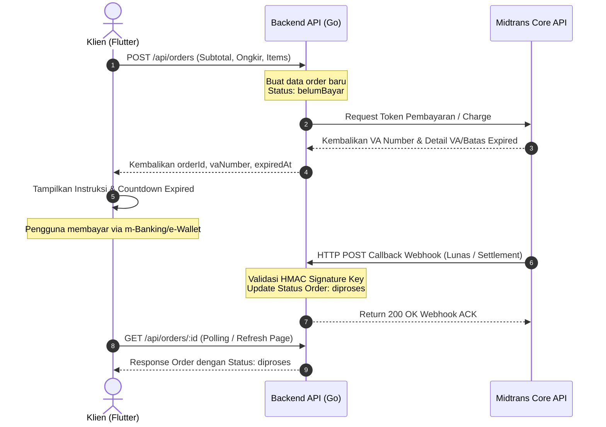
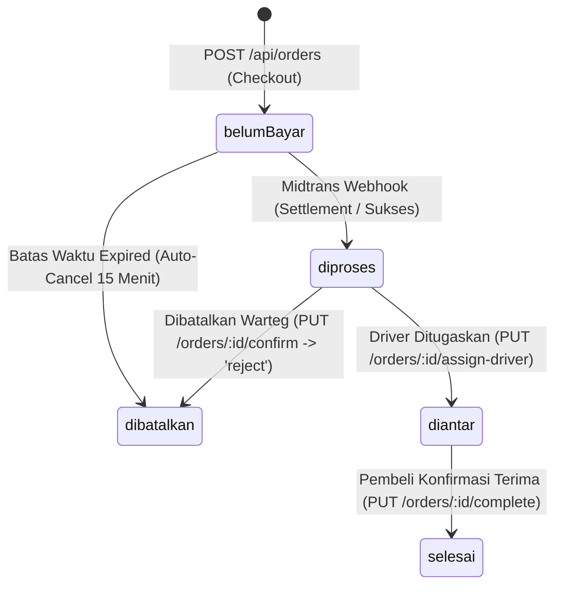

# Panduan Integrasi Frontend (FE Integration Guide) — Warteg App

Dokumen ini adalah spesifikasi teknis komprehensif bagi Frontend Developer (Flutter) untuk mengintegrasikan aplikasi klien dengan **Warteg Backend API**.

---

## 1. Spesifikasi Umum & Global

### A. Base URL

* **Local Development (Emulator Android)**: `http://192.168.17.122:8080`
* **Local Development (iOS Simulator / Web)**: `http://localhost:8080`
* **Production Server**: `https://api.warteg.com` (sesuaikan dengan domain server rilis)

### B. Global Headers

Semua request yang ditujukan ke endpoint terproteksi wajib menyertakan token JWT pada header `Authorization` dengan skema **Bearer Token**:

```http
Content-Type: application/json
Authorization: Bearer <JWT_TOKEN>
```

### C. Standard Response Wrapper

Backend menggunakan standard response wrapper untuk setiap endpoint REST API.

#### 1. Success Response Structure

```json
{
  "status": "success",
  "message": "Informasi pesan opsional",
  "data": { ... } // Dapat berupa objek JSON atau array []
}
```

#### 2. Paginated Response Structure

```json
{
  "status": "success",
  "data": [ ... ],
  "meta": {
    "page": 1,
    "limit": 10,
    "totalItems": 45,
    "totalPages": 5
  }
}
```

#### 3. Error Response Structure

```json
{
  "status": "error",
  "code": "ERR_CODE_EXAMPLE", // Kode error unik untuk penanganan logika FE
  "message": "Detail pesan kesalahan yang ramah pengguna"
}
```

---

## 2. Pemetaan & Konversi Tipe Data

Berikut panduan konversi tipe data dari tipe kolom Database PostgreSQL ke tipe data Dart Flutter:

| PostgreSQL Type | Dart Type | Strategi Parsing di Flutter |
| :--- | :--- | :--- |
| `UUID` | `String` | Disimpan sebagai `String` biasa |
| `VARCHAR` / `TEXT` | `String` | Menampung string karakter biasa |
| `INTEGER` / `BIGINT` | `int` | Bilangan bulat |
| `NUMERIC(p,s)` / `FLOAT`| `double` | Di-parse via `double.parse(value.toString())` |
| `BOOLEAN` | `bool` | Logika `true` atau `false` |
| `TIMESTAMP WITH TZ` | `DateTime` | Diparsing menggunakan `DateTime.parse(value)` |
| `JSONB` | `List<dynamic>` / `Map<String, dynamic>` | Menggunakan kelas parser Dart custom |

---

## 3. Strategi Penyimpanan Lokal (SharedPreferences Cache)

Aplikasi klien menyimpan data tertentu di memori lokal (`SharedPreferences`) untuk fungsionalitas offline, auto-fill, dan retensi sesi.

| Key | Tipe Data | Tujuan Caching |
| :--- | :--- | :--- |
| `auth_token` | `String` | JWT token untuk otorisasi API terproteksi |
| `is_login` | `bool` | Flag penanda sesi aktif pengguna |
| `user_profile` | `String` (JSON) | Cache informasi profil user (`id`, `username`, `email`, `role`) |
| `cart_items` | `String` (JSON) | Menyimpan data keranjang belanja offline (List items + Add-ons) |
| `payment_details` | `String` (JSON) | Caching kredensial pembayaran (Auto-fill saat checkout) |
| `subscription_{topic}` | `bool` | Pengaturan toggle push notification berdasarkan topik (cth: `subscription_promo`) |
| `purchase_history` | `String` (JSON) | Menyimpan data histori pembelian (nama produk & frekuensi) untuk statistik menu favorit |

---

## 4. Modul-Modul API & Integrasi Flutter

Setiap modul dilengkapi contoh endpoint, response payload, model Dart, dan inisialisasi state **Riverpod**.

### A. Modul Autentikasi (Authentication)

#### 1. Registrasi Akun Baru

* **Endpoint**: `POST /api/auth/register`
* **Auth Required**: No
* **Request Payload**:

    ```json
    {
      "username": "faizhilmy",
      "email": "faiz@warteg.com",
      "password": "mySecurePassword123"
    }
    ```

* **Response (201 Created)**:

    ```json
    {
      "status": "success",
      "message": "Registrasi berhasil silakan login",
      "data": {
        "id": "e6a2bb53-dfc5-4d2b-b6d4-d890cf2c125a",
        "username": "faizhilmy",
        "email": "faiz@warteg.com"
      }
    }
    ```

#### 2. Login & Dapatkan Token

* **Endpoint**: `POST /api/auth/login`
* **Auth Required**: No
* **Request Payload**:

    ```json
    {
      "email": "faiz@warteg.com",
      "password": "mySecurePassword123"
    }
    ```

* **Response (200 OK)**:

    ```json
    {
      "status": "success",
      "message": "Login berhasil",
      "data": {
        "token": "eyJhbGciOiJIUzI1NiIsInR5cCI6IkpXVCJ9...",
        "user": {
          "id": "e6a2bb53-dfc5-4d2b-b6d4-d890cf2c125a",
          "username": "faizhilmy",
          "email": "faiz@warteg.com",
          "role": "user"
        }
      }
    }
    ```

#### 3. Dapatkan Detail Profil User Aktif

* **Endpoint**: `GET /api/auth/me`
* **Auth Required**: Yes
* **Response (200 OK)**:

    ```json
    {
      "status": "success",
      "data": {
        "id": "e6a2bb53-dfc5-4d2b-b6d4-d890cf2c125a",
        "username": "faizhilmy",
        "email": "faiz@warteg.com",
        "role": "user"
      }
    }
    ```

#### 4. Model Dart `UserModel` & Sesi Provider

```dart
class UserModel {
  final String id;
  final String username;
  final String email;
  final String role;

  UserModel({
    required this.id,
    required this.username,
    required this.email,
    required this.role,
  });

  factory UserModel.fromJson(Map<String, dynamic> json) {
    return UserModel(
      id: json['id'] as String,
      username: json['username'] as String,
      email: json['email'] as String,
      role: json['role'] as String,
    );
  }

  Map<String, dynamic> toJson() => {
        'id': id,
        'username': username,
        'email': email,
        'role': role,
      };
}
```

```dart
// Riverpod State Notifier untuk Autentikasi
import 'package:flutter_riverpod/flutter_riverpod.dart';
import 'package:shared_preferences/shared_preferences.dart';

class AuthState {
  final bool isAuthenticated;
  final String? token;
  final UserModel? user;
  final String? errorMessage;

  AuthState({
    this.isAuthenticated = false,
    this.token,
    this.user,
    this.errorMessage,
  });

  AuthState copyWith({
    bool? isAuthenticated,
    String? token,
    UserModel? user,
    String? errorMessage,
  }) {
    return AuthState(
      isAuthenticated: isAuthenticated ?? this.isAuthenticated,
      token: token ?? this.token,
      user: user ?? this.user,
      errorMessage: errorMessage ?? this.errorMessage,
    );
  }
}

class AuthNotifier extends StateNotifier<AuthState> {
  AuthNotifier() : super(AuthState()) {
    _loadSession();
  }

  Future<void> _loadSession() async {
    final prefs = await SharedPreferences.getInstance();
    final token = prefs.getString('auth_token');
    final userJson = prefs.getString('user_profile');
    if (token != null && userJson != null) {
      // Decode dan set state awal
      // state = state.copyWith(isAuthenticated: true, token: token, user: UserModel.fromJson(jsonDecode(userJson)));
    }
  }

  Future<bool> login(String email, String password) async {
    // Panggil API POST /api/auth/login
    // Jika sukses:
    // 1. Simpan token & profile ke SharedPreferences
    // 2. Perbarui state
    return true;
  }

  Future<void> logout() async {
    final prefs = await SharedPreferences.getInstance();
    await prefs.remove('auth_token');
    await prefs.remove('is_login');
    await prefs.remove('user_profile');
    state = AuthState();
  }
}

final authProvider = StateNotifierProvider<AuthNotifier, AuthState>((ref) => AuthNotifier());
```

---

### B. Modul Menu / Produk (Products)

#### 1. Dapatkan Semua Daftar Menu

* **Endpoint**: `GET /api/products`
* **Auth Required**: Yes
* **Response (200 OK)**:

    ```json
    {
      "status": "success",
      "data": [
        {
          "id": "a90dfb11-2090-482a-aef2-588bc9a803f2",
          "name": "Cumi Cabe Ijo",
          "description": "Cumi segar dimasak cabai hijau pedas gurih.",
          "price": 15000.0,
          "category": "lauk",
          "isAvailable": true,
          "imageUrl": "https://storage.warteg.com/products/cumicabeijo.png"
        }
      ]
    }
    ```

#### 2. Dapatkan Detail Menu Tunggal

* **Endpoint**: `GET /api/products/:id`
* **Auth Required**: Yes
* **Response (200 OK)**:

    ```json
    {
      "status": "success",
      "data": {
        "id": "a90dfb11-2090-482a-aef2-588bc9a803f2",
        "name": "Cumi Cabe Ijo",
        "description": "Cumi segar dimasak cabai hijau pedas gurih.",
        "price": 15000.0,
        "category": "lauk",
        "isAvailable": true,
        "imageUrl": "https://storage.warteg.com/products/cumicabeijo.png"
      }
    }
    ```

#### 3. Tambah Menu Baru (Admin Only)

* **Endpoint**: `POST /api/products`
* **Auth Required**: Yes (Role Admin)
* **Request Payload**:

    ```json
    {
      "name": "Es Teh Manis",
      "description": "Es teh manis segar penyegar dahaga.",
      "price": 3500.0,
      "category": "minuman",
      "imageUrl": "https://storage.warteg.com/products/esteh.png"
    }
    ```

#### 4. Model Dart `ProductModel` & API Service

```dart
class ProductModel {
  final String id;
  final String name;
  final String description;
  final double price;
  final String category;
  final bool isAvailable;
  final String imageUrl;

  ProductModel({
    required this.id,
    required this.name,
    required this.description,
    required this.price,
    required this.category,
    required this.isAvailable,
    required this.imageUrl,
  });

  factory ProductModel.fromJson(Map<String, dynamic> json) {
    return ProductModel(
      id: json['id'] as String,
      name: json['name'] as String,
      description: json['description'] ?? '',
      price: (json['price'] as num).toDouble(),
      category: json['category'] as String,
      isAvailable: json['isAvailable'] ?? true,
      imageUrl: json['imageUrl'] ?? '',
    );
  }
}
```

```dart
// Riverpod Provider untuk memuat daftar menu
final menuListProvider = FutureProvider<List<ProductModel>>((ref) async {
  final dio = ref.watch(dioProvider); // instance network client terotentikasi
  final response = await dio.get('/api/products');
  final list = response.data['data'] as List;
  return list.map((e) => ProductModel.fromJson(e)).toList();
});
```

---

### C. Modul Alamat (Addresses)

#### 1. Dapatkan Daftar Alamat Tersimpan

* **Endpoint**: `GET /api/addresses`
* **Response (200 OK)**:

    ```json
    {
      "status": "success",
      "data": [
        {
          "id": "addr-1122-3344",
          "label": "Rumah",
          "receiverName": "Faiz Hilmy",
          "phoneNumber": "08123456789",
          "fullAddress": "Jl. Margonda Raya No. 10, Depok",
          "note": "Pagar hitam",
          "isSelected": true
        }
      ]
    }
    ```

#### 2. Simpan Alamat Baru

* **Endpoint**: `POST /api/addresses`
* **Request Payload**:

    ```json
    {
      "label": "Kantor",
      "receiverName": "Faiz Hilmy",
      "phoneNumber": "08123456789",
      "fullAddress": "Gedung A Lantai 3, SCBD, Jakarta",
      "note": "Lobi utama"
    }
    ```

* **Response (201 Created)**:

    ```json
    {
      "status": "success",
      "message": "Alamat berhasil ditambahkan",
      "data": {
        "id": "addr-5566-7788",
        "label": "Kantor",
        "receiverName": "Faiz Hilmy",
        "phoneNumber": "08123456789",
        "fullAddress": "Gedung A Lantai 3, SCBD, Jakarta",
        "note": "Lobi utama",
        "isSelected": false
      }
    }
    ```

#### 3. Tandai Alamat Sebagai Alamat Utama (Selected)

* **Endpoint**: `PUT /api/addresses/:id/select`
* **Response (200 OK)**:

    ```json
    {
      "status": "success",
      "message": "Alamat utama berhasil diperbarui"
    }
    ```

> [!NOTE]
> Database dilengkapi trigger `trigger_reset_default_address`. Setiap kali FE memanggil endpoint `PUT /addresses/:id/select`, backend secara otomatis mereset seluruh alamat user lain menjadi `isSelected = false` dan alamat target menjadi `true`. FE cukup melakukan re-fetch daftar alamat setelah memanggil endpoint ini.

---

### D. Modul Transaksi & Pesanan (Orders)

#### 1. Pembuatan Pesanan Baru (Checkout)

* **Endpoint**: `POST /api/orders`
* **Request Payload**:

    ```json
    {
      "deliveryType": "delivery",
      "addressId": "addr-1122-3344", // Nullable jika pickup
      "paymentMethodName": "GoPay",
      "paymentMethodImage": "assets/images/payment/gopay.png",
      "subtotal": 15000,
      "ongkir": 5000,
      "discount": 1500,
      "total": 18500,
      "sellerNote": "Cumi dipisah nasinya",
      "items": [
        {
          "productId": "a90dfb11-2090-482a-aef2-588bc9a803f2",
          "quantity": 1,
          "price": 15000,
          "addOns": [
            {
              "name": "Nasi Setengah",
              "price": 3000
            }
          ]
        }
      ]
    }
    ```

* **Response (201 Created)**:

    ```json
    {
      "status": "success",
      "message": "Pesanan berhasil dibuat",
      "data": {
        "orderId": "order-9988-7766",
        "vaNumber": "90012345678901",
        "expiredAt": "2026-06-07T16:30:00Z"
      }
    }
    ```

#### 2. Dapatkan Riwayat Pesanan

* **Endpoint**: `GET /api/orders`
* **Response (200 OK)**:

    ```json
    {
      "status": "success",
      "data": [
        {
          "id": "order-9988-7766",
          "deliveryType": "delivery",
          "paymentMethod": {
            "name": "GoPay",
            "image": "assets/images/payment/gopay.png",
            "isSelected": true
          },
          "subtotal": 15000,
          "ongkir": 5000,
          "discount": 1500,
          "total": 18500,
          "sellerNote": "Cumi dipisah nasinya",
          "status": "diproses",
          "vaNumber": "90012345678901",
          "createdAt": "2026-06-07T16:15:00Z",
          "expiredAt": "2026-06-07T16:30:00Z",
          "cancelExpiredAt": null,
          "acceptedByAdmin": true,
          "driver": {
            "id": "drv-001",
            "name": "Budi Santoso",
            "phone": "08987654321",
            "vehicleNumber": "B 4567 CDI"
          },
          "address": {
            "id": "addr-1122-3344",
            "label": "Rumah",
            "receiverName": "Faiz Hilmy",
            "phoneNumber": "08123456789",
            "fullAddress": "Jl. Margonda Raya No. 10, Depok",
            "note": "Pagar hitam",
            "isSelected": true
          },
          "items": [
            {
              "id": "item-abc-111",
              "menuId": "a90dfb11-2090-482a-aef2-588bc9a803f2",
              "menuName": "Cumi Cabe Ijo",
              "imageUrl": "https://storage.warteg.com/products/cumicabeijo.png",
              "quantity": 1,
              "price": 15000,
              "totalHarga": 15000,
              "addOns": [
                {
                  "name": "Nasi Setengah",
                  "price": 3000
                }
              ]
            }
          ]
        }
      ]
    }
    ```

#### 3. Konfirmasi Pesanan Selesai oleh Pengguna

* **Endpoint**: `PUT /api/orders/:id/complete`
* **Response (200 OK)**:

    ```json
    {
      "status": "success",
      "message": "Pesanan dinyatakan selesai"
    }
    ```

> [!TIP]
> Ketika pengguna sukses mengonfirmasi pesanan selesai, FE wajib mengupdate data `purchase_history` di `SharedPreferences` lokal. Ini digunakan untuk mengakumulasi menu-menu teratas yang paling sering dibeli pada halaman statistik pembelian pribadi.

---

### E. Modul Obrolan (Chats)

#### 1. Dapatkan Histori Chat Pesanan

* **Endpoint**: `GET /api/chats?orderId=:orderId`
* **Response (200 OK)**:

    ```json
    {
      "status": "success",
      "data": [
        {
          "id": "msg-1111",
          "orderId": "order-9988-7766",
          "text": "Halo pak, tolong cumi cabe ijonya dibuat ekstra pedas ya.",
          "sender": "user",
          "isRead": true,
          "isSystem": false,
          "createdAt": "2026-06-07T16:18:20Z"
        }
      ]
    }
    ```

#### 2. Kirim Pesan Chat Baru (HTTP POST)

* **Endpoint**: `POST /api/chats`
* **Request Payload**:

    ```json
    {
      "orderId": "order-9988-7766",
      "text": "Sudah sampai mana ya pak?"
    }
    ```

* **Response (201 Created)**:

    ```json
    {
      "status": "success",
      "data": {
        "id": "msg-4444",
        "orderId": "order-9988-7766",
        "sender": "user",
        "text": "Sudah sampai mana ya pak?",
        "isRead": false,
        "isSystem": false,
        "createdAt": "2026-06-07T16:21:00Z"
      }
    }
    ```

---

### F. Modul Promo & Voucher (Promos)

#### 1. Dapatkan Semua Daftar Kupon Aktif

* **Endpoint**: `GET /api/promos`
* **Response (200 OK)**:

    ```json
    {
      "status": "success",
      "data": [
        {
          "code": "SAVE5",
          "title": "Diskon 5%",
          "discountPercent": 5,
          "isActive": true
        }
      ]
    }
    ```

---

### G. Modul Notifikasi (Notifications)

#### 1. Dapatkan Daftar Notifikasi Masuk

* **Endpoint**: `GET /api/notifications`
* **Response (200 OK)**:

    ```json
    {
      "status": "success",
      "data": [
        {
          "id": "notif-abc-999",
          "title": "Pesanan Sedang Diantar",
          "message": "Pesanan Anda #order-9988-7766 sedang diantar.",
          "orderId": "order-9988-7766",
          "isRead": false,
          "createdAt": "2026-06-07T16:20:00Z"
        }
      ]
    }
    ```

#### 2. Tandai Semua Notifikasi Telah Dibaca

* **Endpoint**: `PUT /api/notifications/read-all`
* **Response (200 OK)**:

    ```json
    {
      "status": "success",
      "message": "Semua notifikasi ditandai telah dibaca"
    }
    ```

---

## 5. Integrasi WebSockets Real-time Chat

Untuk mendukung sinkronisasi real-time obrolan di halaman koordinasi pengiriman, sistem menggunakan protokol WebSockets (`ws://` atau `wss://`).

### A. Alamat URL WS Connection

* **URL Format**: `ws://<base_url>/ws/chat?orderId=<ORDER_ID>&userId=<USER_ID>`
* **Contoh**: `ws://localhost:8080/ws/chat?orderId=order-9988-7766&userId=e6a2bb53-dfc5-4d2b-b6d4-d890cf2c125a`

### B. Format Payload WebSocket dari Server

Setiap ada chat baru masuk dari room tersebut, server akan mengirimkan frame WebSocket dalam format JSON berikut:

```json
{
  "type": "chat",
  "orderId": "order-9988-7766",
  "data": {
    "id": "msg-5555",
    "orderId": "order-9988-7766",
    "sender": "admin",
    "text": "Saya sudah di depan komplek pak.",
    "isRead": false,
    "isSystem": false,
    "createdAt": "2026-06-07T16:22:15Z"
  }
}
```

### C. Implementasi WebSocket Client di Flutter (Riverpod)

Frontend menggunakan package `web_socket_channel` untuk mengelola stream socket dan memancarkan data baru ke UI:

```dart
import 'dart:convert';
import 'package:flutter_riverpod/flutter_riverpod.dart';
import 'package:web_socket_channel/web_socket_channel.dart';

// Menampung chat instan baru
class ChatMessageModel {
  final String id;
  final String orderId;
  final String sender;
  final String text;
  final bool isRead;
  final bool isSystem;
  final DateTime createdAt;

  ChatMessageModel({
    required this.id,
    required this.orderId,
    required this.sender,
    required this.text,
    required this.isRead,
    required this.isSystem,
    required this.createdAt,
  });

  factory ChatMessageModel.fromJson(Map<String, dynamic> json) {
    return ChatMessageModel(
      id: json['id'] as String,
      orderId: json['orderId'] as String,
      sender: json['sender'] as String,
      text: json['text'] as String,
      isRead: json['isRead'] as bool? ?? false,
      isSystem: json['isSystem'] as bool? ?? false,
      createdAt: DateTime.parse(json['createdAt'] as String),
    );
  }
}

// StreamProvider untuk memantau koneksi WebSocket per Order
final orderChatStreamProvider = StreamProvider.family<ChatMessageModel, String>((ref, orderId) async* {
  final authState = ref.watch(authProvider);
  final userId = authState.user?.id ?? '';
  
  // Koneksi ke WebSocket Server
  final channel = WebSocketChannel.connect(
    Uri.parse('ws://10.0.2.2:8080/ws/chat?orderId=$orderId&userId=$userId'),
  );

  ref.onDispose(() {
    channel.sink.close();
  });

  // Listen frame dari server
  await for (final message in channel.stream) {
    final Map<String, dynamic> rawMsg = jsonDecode(message);
    if (rawMsg['type'] == 'chat') {
      yield ChatMessageModel.fromJson(rawMsg['data']);
    }
  }
});
```

---

## 6. Alur Integrasi Midtrans Payment Gateway

Aplikasi menggunakan Midtrans untuk menangani proses transaksi digital (e-wallet, bank transfer).



### A. Keamanan Webhook Midtrans (Signature Verification)

Setiap callback dari Midtrans di-validasi signature-nya di backend menggunakan formula:
$$\text{Signature Key} = \text{hash\_sha512}(\text{order\_id} + \text{status\_code} + \text{gross\_amount} + \text{ServerKey})$$

> [!WARNING]
> Frontend **TIDAK BOLEH** langsung mengupdate status pembayaran order ke database secara lokal/direct client bypass. Status pesanan hanya boleh diubah secara otomatis oleh server backend melalui Webhook Midtrans Callback di endpoint `/api/payment/midtrans/callback`. Frontend cukup melakukan polling status pesanan atau menggunakan real-time listeners.

---

## 7. State Machine Status Transaksi (Order State Lifecycle)

Frontend harus menampilkan halaman detail pesanan secara dinamis berdasarkan status string yang dikembalikan oleh API:



### Penanganan Halaman Frontend Berdasarkan Status

1. **`belumBayar`**: Tampilkan nomor Virtual Account, cara bayar, tombol "Salin No Rekening", serta visual countdown timer yang berakhir pada `expiredAt`.
2. **`diproses`**: Tampilkan animasi koki sedang menyiapkan makanan.
3. **`diantar`**: Aktifkan halaman pelacakan kurir terintegrasi. Tampilkan nama driver, plat kendaraan, dan opsi chat instan untuk koordinasi langsung.
4. **`selesai`**: Tampilkan detail transaksi final, daftar item belanja, subtotal, dan opsi untuk mengunduh struk digital.
5. **`dibatalkan`**: Tampilkan pesan error pembatalan beserta alasan pembatalan dari penjual/sistem.
